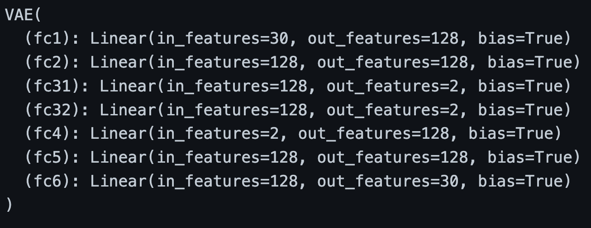
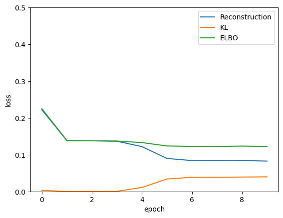
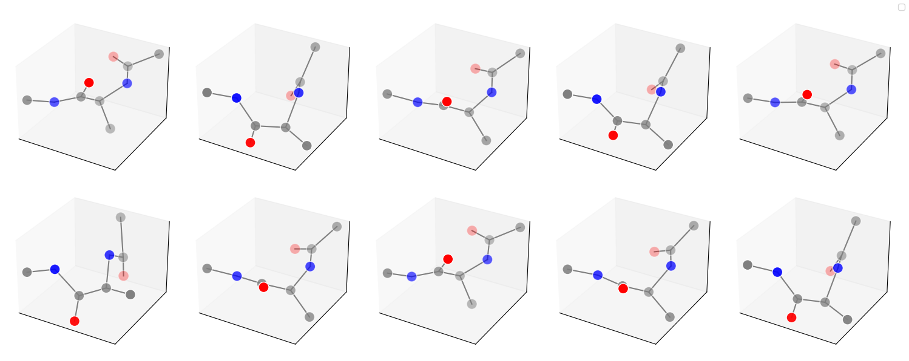

 # A generative model for alanine dipeptide

## 文件树
```
|----data
|----datasets
|----pic                     (结果图)
|----ML4P.ipynb             （课程项目代码）          ***
|----simple_VAE.ipynb       （学习VAE的代码） 
|----VAE_tutorial.ipynb     （复现dmol例子1的代码）
|----VAE.ipynb              （复现dmol例子2的代码）
|----README.md
```

## Variational Autoencoder (VAE) 原理

Varitional Autoencoder(VAE)是一种生成模型，它的目标是学习一个潜在空间(latent space)的分布，然后通过这个分布来生成新的数据。生成模型可以认为是学习了数据的分布 $\hat{P}(x)$ ，因此可以用来生成新的数据。


VAE通过引入潜在变量 $z$ 来学习数据集的分布：  
        $$\hat{P}(x) = \int \hat{P}(x|z)P(z) dz$$
的形式，其中 $P(z)$ 是潜在变量的先验分布。一个简单的VAE模型如下图所示：

<p align = "center">

</p>


VAE由两部分构成：编码器(encoder)和解码器(decoder)。编码器 $q_{\phi}(z|x)$ 将输入数据 $x$ 映射到潜在空间 $z$ ，解码器 $p_{\theta}(x|z)$ 将潜在变量 $z$ 映射到数据空间 $x$ , 其中 $\theta$ 和 $\phi$ 是神经网络的训练参数。编码器和解码器都是神经网络，因此VAE也是一种神经网络模型。

VAE的损失函数是log-likelihood，即： $log[ \hat{P}(x) ]$ . 由于 $\hat{P}(x)$ 是不可解的，因此VAE使用变分推断的方法来近似 $\hat{P}(x)$ 。这样，VAE的损失函数可以写成：

$$L(\theta, \phi) = -E_{z\sim q_{\phi}(z|x)}[log(p_{\theta}(x|z))] + KL(q_{\phi}(z|x)||p(z))$$

第一部分是重构误差，用来表征从 $x$ -> $z$ -> $x$ 的损失，第二部分是KL散度（Kullback–Leibler divergence），用于测量编码器与我们定义的 $P(z)$（正态分布）的接近程度。具体推导可以参考（ https://dmol.pub/dl/VAE.html ）。在实际计算中，我们选取 $P(z)$ 为正态分布，即 $P(z) = N(0, 1)$ ，这样KL散度可以直接写出下列形式：
$$KL[(q_{\theta}(z|x_{i}))||P(z)] = -log \sigma_{i} + \frac{\sigma_{i}^{2}}{2}+\frac{\mu_{i}^{2}}{2}-\frac{1}{2}$$
其中 $\mu_{i}$ , $\sigma_{i}$ 是 $q_{\phi}(z|x_{i})$ 的输出。

## 生成分子轨迹的VAE模型

### 数据集
https://markovmodel.github.io/mdshare/ALA2/#alanine-dipeptide

### 网络结构

<p align = "center">

</p>

### 

VAE的输入参量为目标分子（Alanine dipeptide）中的10个重原子的xyz坐标（特征向量长度为30）。隐藏层大小设置为128，一共有两个隐藏层。潜在变量大小设为2，这是因为在文献中该分子的两个二面角（$\Phi$, $\Psi$）一般假设包含系统的所有长时间行为信息。同时在训练过程中，我们随机得去打乱分子构型的数据，不考虑任何时序的信息。因为特征向量长度较短，所以没有引入卷积等降维操作，只采用最基础的MLP网络。

### 训练设置
```
batch_size = 100
num_epochs = 10
input_dim = 30
hidden_dim = 128
latent_dim = 2
```
在开始训练之前，需要对数据进行预处理，使得第一个重原子的坐标为（0，0，0）。如果不进行这一步，因为分子的漂移，最后生成模型生成出来的构型将会非常接近。训练只选取了部分数据。
```
data = np.load('./data/alanine-dipeptide-3x250ns-heavy-atom-positions.npz')['arr_0'][:10000]
natoms = 10
dim = 3
data = data.reshape(-1, natoms, dim)
data -= data[:, None, 0]
data = data.reshape(-1, natoms * dim)
```

训练在1张NVIDIA Tesla V100上进行。

### 损失函数

<p align = "center">

</p>

### 生成结果

<p align = "center">

</p>

### 可能的应用前景
1. 对蛋白质分子构象进行采样，蛋白质的空间结构对于蛋白质的功能至关重要，如果能直接生成蛋白质的构象，那么可以大大加快蛋白质的设计过程。
2. 对于催化吸附系统进行采样。在多相催化中，识别活性吸附位点和稳定的催化剂构型是设计催化剂的关键。如果能够直接生成催化剂的构型，那么可以大大加快催化剂的设计过程。

## 参考资料
1. https://dmol.pub/index.html
2. https://pubs.aip.org/aip/jcp/article-abstract/148/24/241703/958887/Time-lagged-autoencoders-Deep-learning-of-slow?redirectedFrom=fulltext
3. https://github.com/wangleiphy/ml4p/blob/main/projects/alanine_dipeptide.ipynb
4. https://doi.org/10.1103/PhysRevX.10.021020
